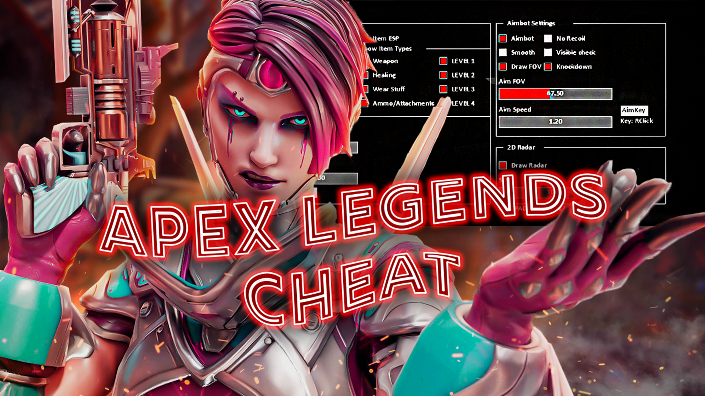

# 🚀 Apex Legends Enhancement Tool 2025: *Ascend to Victory* 🥇

Welcome to the **Apex Legends Enhancement Tool 2025**, an advanced sandbox-oriented platform designed for developers, UI/UX testers, and AI researchers to simulate, analyze, and prototype various gameplay mechanics in *Apex Legends* environments. Whether you're a passionate modder or a researcher seeking to push the limits of interactivity and control, this tool provides a robust set of utilities to deepen your experience and insight.

---

## 🧠 What Is This Tool?

The **Apex Legends Enhancement Tool** is a modular software environment aimed at:

- **AI and input testing**
- **Combat simulation**
- **User experience and HUD prototyping**
- **Sandbox-based experimentation**
- **Advanced movement and targeting logic emulation**

> ⚠️ **Disclaimer:** This tool is strictly intended for educational, development, and offline/sandbox use. It is **not** designed, nor should it be used, to gain unfair advantages in online multiplayer matches. Violating the terms of any game’s EULA or TOS is not supported.

---

## ✨ Key Features

### 🎯 Targeting Assistant (Aimbot Simulation)
> Emulate aim adjustment logic and build/test predictive targeting algorithms.

- Configurable tracking sensitivity and smoothing
- Great for AI bot tuning or aim-behavior prototyping

### 🔍 Visual Overlay (ESP)
> Advanced Environmental Scan & Projection overlays.

- Visualize hitboxes, items, and movement through surfaces
- Useful for UI/HUD testing and obstacle mapping

### 💎 Resource Virtualization
> Simulate endless loadouts for training environments.

- No reloads or ammo depletion
- Great for weapon performance testing and extended simulations

### ⚡ Mobility Modifications
> Real-time tweaking of movement parameters.

- Walk speed, sprint modifiers, jump height
- Ideal for studying pathfinding and evasion strategies

### 🌐 Clean UI/UX Design
> Built with accessibility and clarity in mind.

- Minimalist layout with real-time toggles
- Supports devs of all experience levels

### 🔄 Regular Updates & Maintenance
> Aligned with major Apex Legends patches (sandbox compatibility).

- Community-supported version tracking
- Modular plugin structure for easy extensibility

### 🔒 Secure, Local Architecture
> Privacy-conscious design — 100% local execution.

- No telemetry, no online activation
- Focus on transparency and code auditability

---

## 📥 How to Download

To get started with the **Apex Legends Enhancement Tool 2025**, follow these steps:

1. Navigate to the [Releases](https://github.com/jimstoll66/apex-legends-free-cheat-2025/releases) section of this repository.
2. Download the latest `.zip` archive from the most recent release.
3. Extract the contents of the archive to a folder of your choice.
4. Run `setup.exe` to install and launch the tool.

> 💡 Make sure your antivirus software doesn't block the setup process, as custom simulation tools may trigger false positives.

---

## 🤝 Community & Collaboration

Join our growing network of developers, game designers, modders, and UI/UX researchers. Share insights, contribute modules, or just explore what’s possible with cutting-edge gameplay prototyping.

- 💬 Developer-friendly Discord
- 📚 Documentation & API references
- 🧩 Plugin templates to kickstart your own modules

---

## 🏆 Why Use This Tool?

- **Refine Your Concepts:** Prototype mechanics that go beyond vanilla gameplay.
- **Build Smarter Bots:** Train or test against AI using real-world game physics and visuals.
- **Explore Creativity:** Tinker with unlimited resources and enhanced visibility to develop new strategies.
- **Respect the Rules:** Created with offline usage and sandbox compliance in mind.

---

## 📜 Legal & Ethical Notice

This project is for **educational and research purposes only**. It is not affiliated with, endorsed by, or connected to *Electronic Arts* or *Respawn Entertainment*. Misuse of this tool in live multiplayer environments can violate game terms of service and result in bans or penalties.

> ✅ Always use in **offline**, **sandbox**, or **private testing environments**.

---

## 🌍 Tags

`#apex-legends-tool` `#sandbox-simulation` `#aim-algorithms` `#UI-testing` `#ESP-overlay` `#movement-simulator` `#resource-sandbox` `#dev-mod-kit` `#offline-enhancer` `#gameplay-lab` `#UX-prototyping`

---

## 🚧 Future Roadmap

- [ ] Full API integration for script-based control
- [ ] AI bot interaction module
- [ ] Expanded mod support for community-made mechanics
- [ ] Linux and Steam Deck compatibility
- [ ] VR/AR experimental interface mode

---

> **Ready to level up your *Apex Legends* development journey?**  
> Download the Apex Legends Enhancement Tool 2025 and explore what lies beyond the meta.
